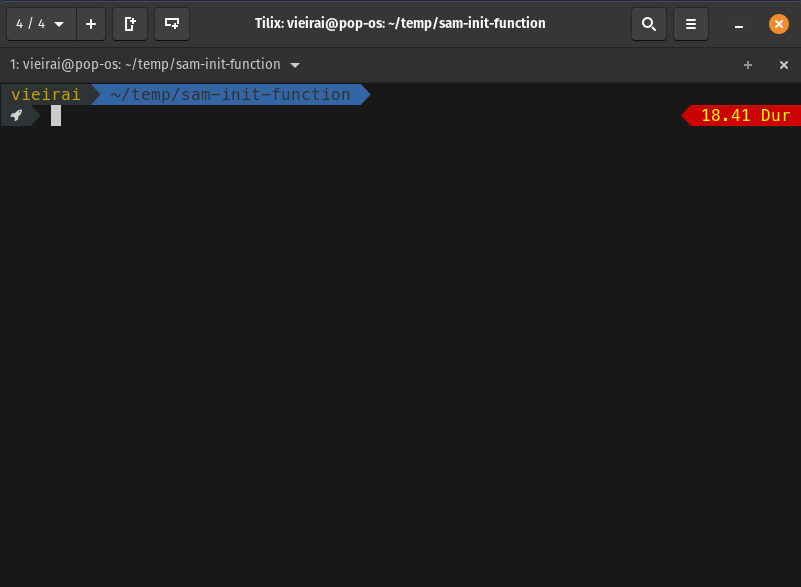

# Lambda Bench
CLI utility for benchmarking lambda cold starts



## Usage

### Lambda event

Measure cold start times on lambda using `RequestResponse` invocation.

Example commands:
```bash
# simple usage
$ lb lambda function-name path/event.json

# help
$ lb lambda help

# other options
$ lb lambda function-name path/event.json \
  --region us-east-1 \
  --iterations 10 \
  --parallel 1 \
  --dependency function-name-1 \
  --dependency function-name-2 \
  --warm # to measure warm invocations
```

### API Gateway event

Measure cold start times on lambda exposed with API Gateway.  
When used in this mode, we measure the HTTP request duration.

Example commands:
```bash
# simple usage
$ lb apig function-name http://my.example.url

# help
$ lb apig help

# other options
$ lb apig function-name http://my.example.url \
  --request POST \
  --header 'header1: value' \
  --header 'header2: value' \
  --body '{}' \
  --iterations 1 \
  --parallel 1 \
  --dependency function-name-1 \
  --dependency function-name-2 \
  --region us-east-1
```

## Contributing


```bash
# install
$ bun install

# lint
$ bun lint

# build
$ bun run build
```
